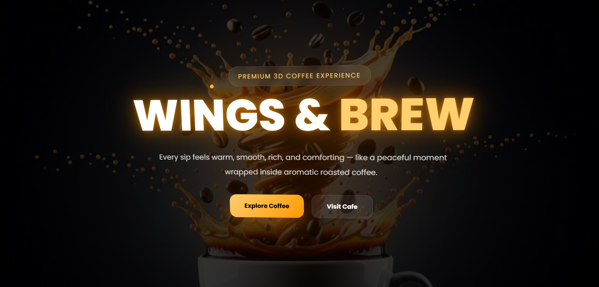

# basic_coffee-brand-website
Basic coffee brand website for beginners
# ☕ Wings & Brew Cafe

<p align="center">
  
</p>

A premium 3D coffee brand website built using HTML, CSS, and JavaScript featuring immersive animations, rotating 3D coffee effects, luxury dark coffee aesthetics, glowing UI elements, and smooth scrolling interactions.

---

# ✨ Features

- ☕ Interactive 3D Coffee Experience
- 🎨 Luxury Dark Coffee Theme
- 🌟 Mouse Movement 3D Effects
- 🔥 Glowing Coffee Lighting Effects
- 💨 Floating Particle Animations
- 📜 Smooth Scroll Reveal Animations
- 🖥️ Fully Responsive Design
- ⚡ Pure HTML, CSS & JavaScript
- 🌀 Auto Rotating Coffee Cup Animation
- 🌑 Cinematic Dark Coffee Background

---

# 🖼️ Website Sections

## 1️⃣ Hero Section

- Fullscreen coffee background
- Floating glowing particles
- 3D mouse interaction
- Premium typography
- Animated buttons
- Coffee branding introduction

---

## 2️⃣ Coffee Story Section

- Rotating 3D coffee cup
- Smooth floating animation
- Dark luxury coffee background
- Animated storytelling content
- Scroll reveal effects
- Coffee glow visual effects

---

# 🛠️ Technologies Used

| Technology | Purpose |
|------------|---------|
| HTML5 | Website Structure |
| CSS3 | Styling & Animations |
| JavaScript | 3D Interactions |
| Google Fonts | Typography |

---

# 📂 Folder Structure

```bash
Wings-And-Brew/
│
├── index.html
├── coffee image.jpg
├── coffee2.png
├── preview.png
└── README.md
```

---

# 🚀 How To Run The Project

## 1️⃣ Clone Repository

```bash
git clone https://github.com/yourusername/wings-and-brew.git
```

---

## 2️⃣ Open Project Folder

Open the folder inside:

- VS Code
- Sublime Text
- Any Code Editor

---

## 3️⃣ Run Website

Simply open:

```bash
index.html
```

OR

Use **Live Server Extension** in VS Code for better experience.

---

# 🌐 Deployment

You can deploy this project easily using:

- GitHub Pages
- Netlify
- Vercel

---

# 📸 Preview

## Hero Section

<p align="center">
  
</p>

---

## Coffee Story Section

<p align="center">
  
</p>

---

# 🎯 Future Improvements

- ☕ Coffee Menu Section
- 🛒 Online Ordering System
- 🎵 Background Cafe Music
- 🌫️ Realistic Coffee Steam Effects
- 📱 Mobile App Version
- ✨ Advanced GSAP Animations
- 🧾 Interactive Product Cards

---

# 💡 Inspiration

Inspired by modern luxury cafe branding, cinematic coffee visuals, and immersive 3D web experiences.

---

# 👨‍💻 Developed By

## Jyo

Made with ☕ passion, creativity, and modern web design.

---

# ⭐ Support

If you like this project:

- ⭐ Star the repository
- 🍴 Fork the project
- 📢 Share with others

---

# 📜 License

This project is open-source and free to use.
